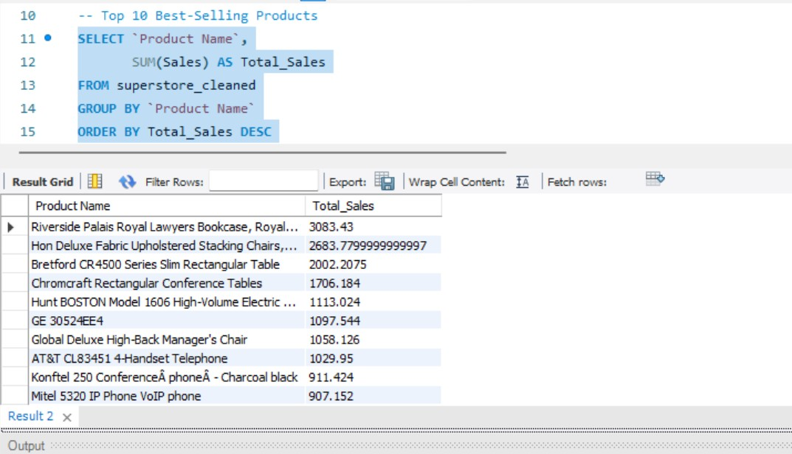
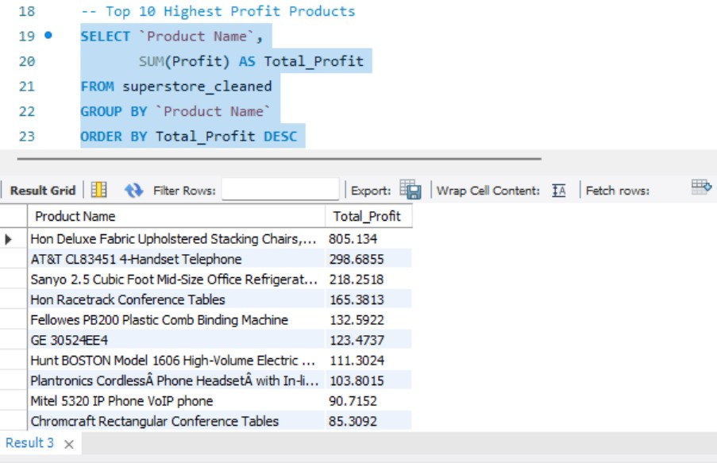
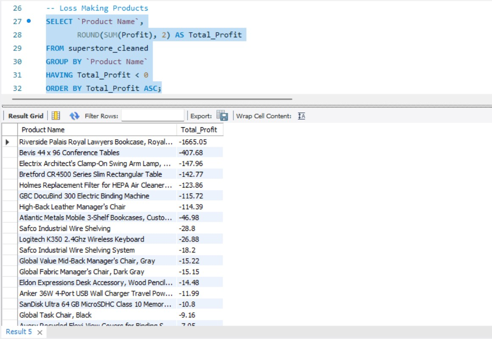
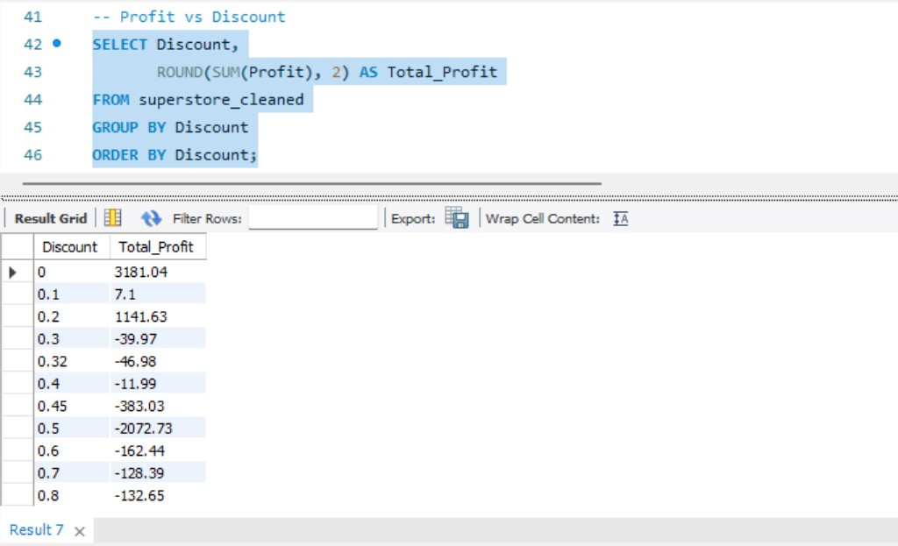
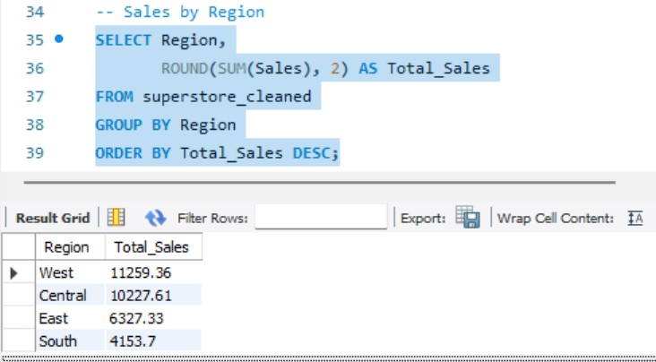
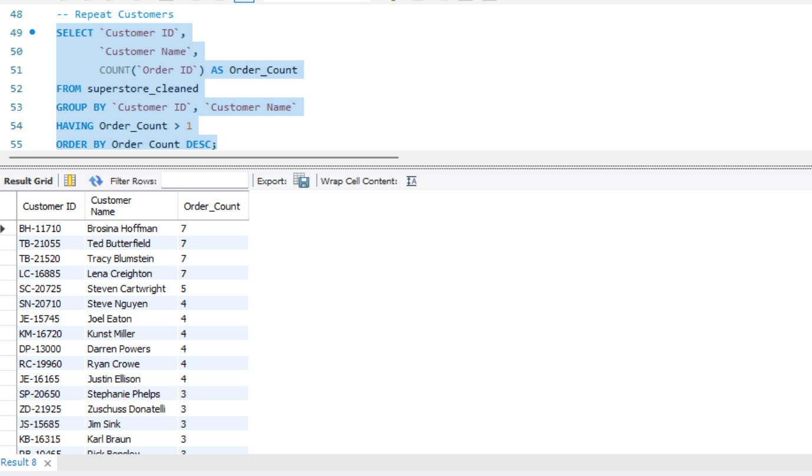
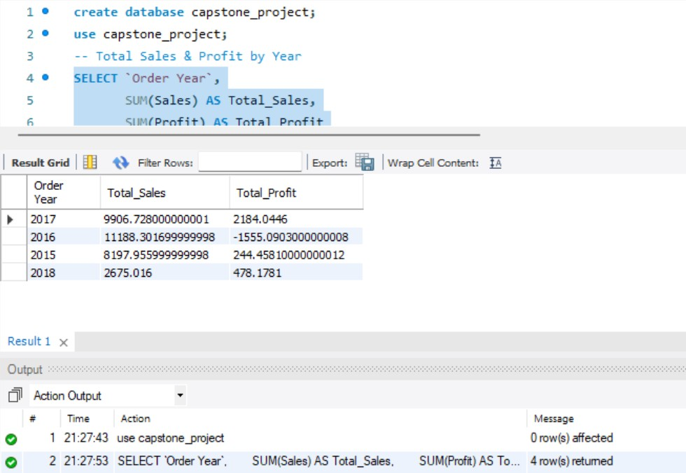

## Sales Analytics Capstone Project
## Project Overview

This is an end-to-end Sales Analytics capstone project created as part of my Data Analytics course.
The project focuses on analyzing sales performance, profit, and discount impact using SQL, Python, and Power BI.

## Business Problem

The objective of this project is to analyze sales data to understand revenue and profit patterns.
The analysis helps identify high-performing products, profitable regions, and areas where discounts negatively impact profit.

## Dataset Description

The dataset contains transactional sales data including order details, sales amount, profit, discount, product categories, and regional information.
This data represents a typical retail sales scenario.

## Data Dictionary

Column Name	               Description
Order ID	                 Unique identifier for each order
Order Date	               Date of transaction
Ship Date	                 Date of shipment
Sales	                     Revenue generated
Profit	                   Profit earned
Discount	                 Discount applied
Category	                 Product category
Sub-Category	             Product sub-category
Region	                   Sales region

## Tools Used

Excel – Initial data understanding

SQL – Data querying and KPI calculations

## SQL Analysis Output

Python (Pandas, Matplotlib) – Data cleaning and EDA

## 🐍 Exploratory Data Analysis (Python)

Power BI – Dashboard creation

GitHub – Project documentation

## Analysis Steps

Understood and cleaned the dataset

Performed SQL queries to calculate KPIs

Conducted exploratory data analysis using Python

Created interactive dashboards in Power BI

Derived insights and business recommendations

## Power BI Dashboard

The Power BI dashboard provides:

Total Sales and Profit KPIs

Sales by Category and Region

Monthly Sales Trends

Discount vs Profit analysis

### Sales Overview
!(
)

### Profit Analysis
!(
)

### Total Sales Trend
!(
)

## Key Insights

Some regions generate high sales but low profit due to heavy discounts

Certain product categories contribute more to overall profit

Monthly sales trends show seasonal patterns

## Business Recommendations

Reduce high discounts on low-profit products

Focus on high-margin categories to improve profitability

Use regional insights to optimize sales strategy

## Project Structure
Sales_Capstone_Project/
│
├── Data/
├── sql_queries/
├── python_notebook/
├── powerbi_reports/
├── presentation/
└── README.md

GitHub Repository
https://github.com/shaikhrashid3687-oss/Sales_Capstone_Project
